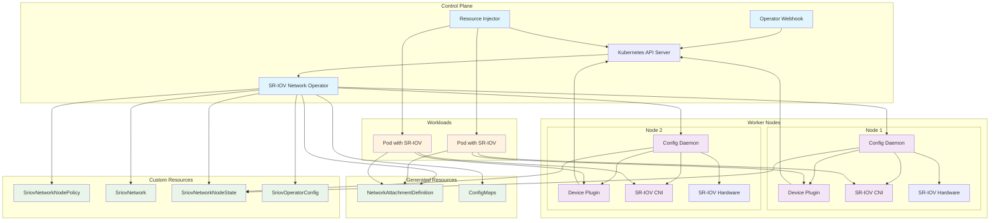

# SR-IOV Network Operator

[](https://opensource.org/licenses/Apache-2.0)

The SR-IOV Network Operator simplifies the deployment and management of SR-IOV networking in Kubernetes and OpenShift clusters.

## What is SR-IOV?

Single Root I/O Virtualization (SR-IOV) allows a single physical network interface to be shared among multiple pods with near-native performance, ideal for high-throughput, low-latency network workloads like CNF, AI/ML, and HPC applications.

## Key Features

- **Automated SR-IOV Setup**: Discovers and configures SR-IOV-capable hardware automatically
- **Device Management**: Provisions SR-IOV device and CNI plugins on worker nodes  
- **Network Policies**: Declarative configuration through Kubernetes Custom Resources
- **Hardware Offloading**: Support for OVS hardware offload and RDMA workloads
- **Virtual Environments**: Works in both bare-metal and some virtualized deployments like Openstack
- **Parallel Operations**: Configures multiple nodes simultaneously to reduce maintenance time

## Architecture

The SR-IOV Network Operator consists of four main components:

### Control Plane Components
- **SR-IOV Network Operator**: Main controller that manages Custom Resources, renders node configurations, and coordinates the overall SR-IOV setup
- **Operator Webhook**: Validates SriovNetworkNodePolicy and SriovOperatorConfig resources to ensure configuration correctness
- **Resource Injector**: Mutating admission webhook that automatically injects SR-IOV resource requests into pods based on network annotations

### Node Components  
- **Config Daemon**: DaemonSet that runs on each node to discover hardware, configure SR-IOV interfaces, and manage VF creation



## Quick Start

### Prerequisites
- SR-IOV-capable hardware (see [supported hardware](doc/supported-hardware.md))
- Kubernetes 1.30+ or OpenShift 4.16+
- Multus CNI installed
- Node Feature Discovery (NFD) for automatic hardware detection (optional)

### Installation

#### OpenShift
```bash
# Deploy with OpenShift defaults
make deploy-setup
```

#### Kubernetes

**Using Helm:**
```bash
helm install -n sriov-network-operator --create-namespace \
  --set sriovOperatorConfig.deploy=true \
  sriov-network-operator \
  oci://ghcr.io/k8snetworkplumbingwg/sriov-network-operator-chart
```

**For clusters with Pod Security Admission enabled:**
```bash
kubectl label ns sriov-network-operator pod-security.kubernetes.io/enforce=privileged
```

### Basic Configuration

1. **Create a node policy** to configure hardware:
```yaml
apiVersion: sriovnetwork.openshift.io/v1
kind: SriovNetworkNodePolicy
metadata:
  name: policy-1
  namespace: sriov-network-operator
spec:
  deviceType: netdevice
  nicSelector:
    pfName: ["ens1f0"]
  nodeSelector:
    feature.node.kubernetes.io/network-sriov.capable: "true"
  numVfs: 4
  resourceName: intelnics
```

2. **Create a network** for workloads:
```yaml
apiVersion: sriovnetwork.openshift.io/v1
kind: SriovNetwork
metadata:
  name: sriov-net
  namespace: default
spec:
  resourceName: intelnics
  ipam: |
    {
      "type": "host-local",
      "subnet": "10.56.217.0/24"
    }
```

3. **Use in a pod**:
```yaml
apiVersion: v1
kind: Pod
metadata:
  name: sample-pod
  annotations:
    k8s.v1.cni.cncf.io/networks: sriov-net
spec:
  containers:
  - name: app
    image: centos:latest
    command: ["sleep", "3600"]
    resources:
      requests:
        openshift.io/intelnics: "1"
      limits:
        openshift.io/intelnics: "1"
```

## Documentation

### Getting Started
- [Installation Guide](doc/quickstart.md) - Detailed installation instructions
- [Supported Hardware](doc/supported-hardware.md) - Compatible network cards and requirements
- [Basic Examples](doc/basic-examples.md) - Common deployment patterns

### API Reference  
- [API Overview](doc/api-overview.md) - Complete Custom Resources documentation
- [Network Configuration](doc/api/sriov-network-api.md) - SriovNetwork and OVSNetwork setup
- [Node Policies](doc/api/node-policies-api.md) - SriovNetworkNodePolicy configuration
- [Pool Configuration](doc/api/pool-config-api.md) - Advanced node pool management
- [Node State](doc/api/node-state-api.md) - SriovNetworkNodeState status (read-only)
- [Operator Configuration](doc/api/operator-config-api.md) - SriovOperatorConfig global settings

### Advanced Topics
- [RDMA Configuration](doc/rdma-configuration.md) - Complete RDMA setup guide  
- [OVS Hardware Offload](doc/ovs-hw-offload.md) - Hardware acceleration with OVS
- [vDPA Support](doc/vdpa.md) - virtio Data Path Acceleration
- [Advanced Features](doc/advanced-features.md) - Feature gates and parallel operations

### Operations
- [Troubleshooting](doc/troubleshooting.md) - Common issues and solutions
- [Monitoring](doc/monitoring.md) - Metrics and observability

### Development
- [Developer Guide](doc/hacking.md) - Building and development workflow
- [Testing Guide](doc/testing-kind.md) - Local testing with KIND
- [Design Documents](doc/design/) - Architecture decisions and designs

## Use Cases

- **Container Network Function (CNF)**: High-performance packet processing
- **AI/ML Workloads**: High-bandwidth data ingestion and model training
- **HPC Applications**: Low-latency inter-node communication
- **Storage Networks**: Dedicated high-speed storage connectivity
- **Edge Computing**: Performance-critical edge applications

## Community

- **Project Home**: [Kubernetes Network Plumbing Working Group](https://github.com/k8snetworkplumbingwg)
- **Issues**: [Report bugs and feature requests](https://github.com/k8snetworkplumbingwg/sriov-network-operator/issues)
- **Discussions**: [Community discussions](https://docs.google.com/document/d/1sJQMHbxZdeYJPgAWK1aSt6yzZ4K_8es7woVIrwinVwI)
- **Contributing**: [Contribution guidelines](CONTRIBUTING.md)

## License

This project is licensed under the Apache License 2.0 - see the [LICENSE](LICENSE) file for details.
