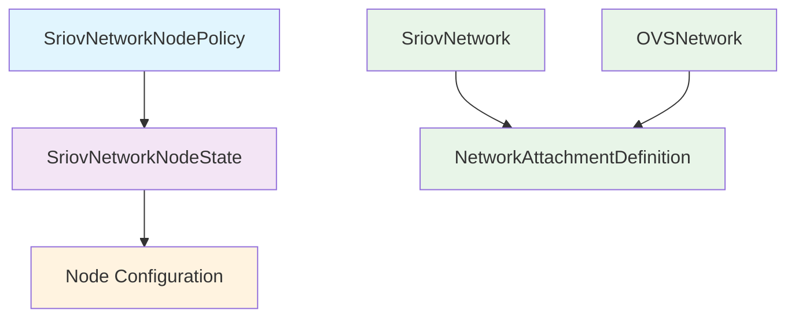

# SR-IOV Network Operator API Reference

The SR-IOV network operator introduces the following Custom Resource Definitions (CRDs):

## Custom Resources Overview

| Resource | Purpose | Managed By                         |
|----------|---------|------------------------------------|
| **SriovNetwork** | Define SR-IOV network configurations and generate NetworkAttachmentDefinition CRs | Cluster Admin or user in namespace |
| **OVSNetwork** | Define OVS hardware-offload network configurations | Cluster Admin or user in namespace                     |
| **SriovNetworkNodeState** | Represent SR-IOV interface states on each node | Operator (read-only for users)     |
| **SriovNetworkNodePolicy** | Configure SR-IOV interfaces and device plugin on selected nodes | Cluster Admin                      |
| **SriovNetworkPoolConfig** | Manage groups of nodes for parallel operations and RDMA configuration | Cluster Admin                      |
| **SriovOperatorConfig** | Configure operator-wide settings, feature gates, and plugin management | Cluster Admin                      |

## Resource Relationships



## Quick Reference

### Basic Network Setup
1. Create `SriovNetworkNodePolicy` to configure hardware
2. Create `SriovNetwork` to define network
3. Reference network in pod annotations

### Advanced Configuration
- Use `SriovNetworkPoolConfig` for parallel node operations
- Configure `SriovOperatorConfig` for global operator configuration and update feature gates
- Monitor `SriovNetworkNodeState` for hardware status on a specific node

## Detailed API Documentation

- [SriovNetwork and OVSNetwork](api/sriov-network-api.md) - Network configuration
- [SriovNetworkNodePolicy](api/node-policies-api.md) - Hardware configuration policies  
- [SriovNetworkPoolConfig](api/pool-config-api.md) - Node pool management
- [SriovNetworkNodeState](api/node-state-api.md) - Node status (read-only)
- [SriovOperatorConfig](api/operator-config-api.md) - Operator configuration

## Validation and Troubleshooting

### Check Node Status
```bash
kubectl get sriovnetworknodestate -n sriov-network-operator
kubectl describe sriovnetworknodestate <node-name> -n sriov-network-operator
```

### Verify Network Configuration
```bash
kubectl get sriovnetwork -A
kubectl get networkattachmentdefinition -A
```

### Monitor Operator
```bash
kubectl get sriovoperatorconfig default -n sriov-network-operator
kubectl logs deployment/sriov-network-operator -n sriov-network-operator
```