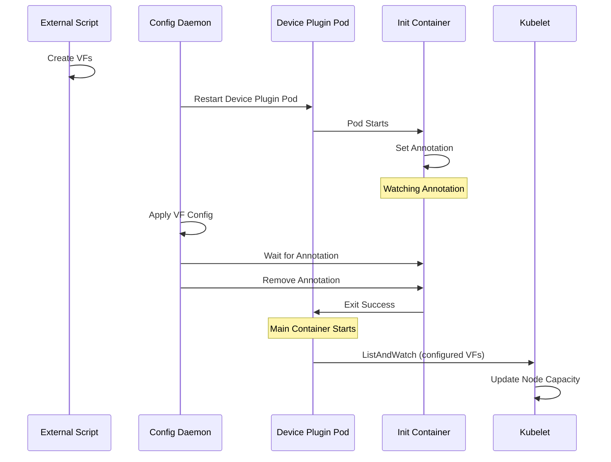

# Block Device Plugin Until Configured

## Summary

This feature introduces a mechanism to prevent the SR-IOV Device Plugin from announcing
SR-IOV resources to the kubelet until the sriov-config-daemon has finished applying
VF configuration on the node. This solves a timing issue that can occur when VFs are
created by an external script or application (using `externallyManaged: true` policy).

## Motivation

### Problem Description

When using policies with `externallyManaged: true`, VFs are created by an external script
or application instead of by the sriov-config-daemon.

The SR-IOV Network Operator (controller) creates the sriov-device-plugin configuration
and enables its DaemonSet pod at the same time it starts applying SR-IOV state to
the node. It does not wait for the sriov-config-daemon to complete configuration of
the node. As a result, the sriov-device-plugin may start and announce resources before
VFs are fully configured by the sriov-config-daemon.

#### Race Condition Sequence

After node provisioning or host reboot, the following sequence can occur:

1. External script or application creates VFs (partially configured, e.g., no RDMA
   GUID assigned)
2. sriov-device-plugin pod starts, discovers VFs created by the external script or application and announces them to the kubelet
3. Kubelet updates node capacity with the announced SR-IOV resources
4. Kubernetes scheduler sees available resources and schedules pods to this node
5. Pods start with partially configured VFs attached to their network namespaces
6. sriov-config-daemon starts and initiates node drain
7. sriov-config-daemon applies VF configuration (unbind/bind VF driver to set RDMA
   GUID, configure MTU, etc.)
8. Pods that were not evicted lose VF connectivity (e.g. managed by DaemonSet)

#### Why VF Configuration Breaks Pod Connectivity

When sriov-config-daemon applies VF configuration, it may need to:

- Unbind and rebind VF drivers to set RDMA Node/Port GUID
- Apply MTU settings
- Configure other VF parameters

The unbind/bind operation causes the VF network interface to disappear from the
host and consequently from any pod's network namespace where it was attached.
The VF is essentially "pulled out" from under the running pod.

#### Impact on Pods

**Pods that are evicted during drain** (e.g., Deployment-managed pods):
- These pods will be evicted during the drain phase
- They will be rescheduled and restarted after configuration is complete
- Eventually these pods will receive properly configured VFs

**Pods that are NOT evicted during drain** (e.g., DaemonSet-managed pods):
- The SR-IOV Network Operator does not support eviction of DaemonSet pods during
  drain
- These pods will silently lose VF connectivity when sriov-config-daemon applies
  configuration
- The VF interface disappears from the pod's network namespace
- The pod continues running but has no network connectivity on the affected interface
- Liveness/readiness probes do not help because they can restart containers, but they
  are not able to trigger recreation of the pod sandbox
- Full pod sandbox recreation is required to restore connectivity
- Manual intervention (e.g., deleting the pod) is needed

### Use Cases

* As a user, I want pods to only receive SR-IOV VFs after they are fully configured
* As a user, I want to avoid silent connectivity loss in DaemonSet pods when using
  externally managed VFs
* As a user, I want the sriov-device-plugin to wait until sriov-config-daemon has
  finished applying configuration before announcing resources

### Goals

* Prevent sriov-device-plugin from announcing resources to kubelet before VF
  configuration by sriov-config-daemon is complete
* Ensure pods only receive fully configured SR-IOV VFs
* Avoid connectivity loss in pods that are not evicted during drain

### Non-Goals

* Changing the drain behavior for DaemonSet pods
* Modifying how externally managed VFs are created
* Changing the VF configuration process itself

## Proposal

Add a new feature gate `blockDevicePluginUntilConfigured` that adds an init container
to the sriov-device-plugin DaemonSet. This init container blocks the device plugin
main container from starting until the sriov-config-daemon signals that configuration
is complete. This feature is enabled by default.

### Workflow Description

#### Init Container Behavior

When the feature gate is enabled:

1. The sriov-device-plugin DaemonSet is deployed with an init container named
   `sriov-device-plugin-init`

2. The init container runs the command `sriov-network-config-daemon wait-for-config`

3. On startup, the init container:
   - Sets a `sriovnetwork.openshift.io/device-plugin-wait-config` annotation on
     its own pod
   - Starts watching for changes to this annotation

4. The init container blocks until the annotation is removed from the pod

5. Once the annotation is removed, the init container exits successfully

6. The main sriov-device-plugin container starts and begins announcing resources

#### Config Daemon Behavior

The sriov-config-daemon removes the `wait-for-config` annotation in two scenarios:

**When applying configuration:**
1. The daemon first restarts the device plugin pod (before applying configuration)
2. The daemon applies SR-IOV configuration
3. After applying configuration, the daemon waits for the new device plugin pod to
   start and set the `wait-for-config` annotation
4. Once the annotation is detected, the daemon removes it if the desired node state
   contains interface configuration
5. Removing the annotation unblocks the init container, allowing the device plugin
   to start announcing resources

**Periodic check (when node is already in sync):**
1. When the node's current configuration matches the desired configuration (no drift),
   the daemon periodically checks for device plugin pods with the annotation
2. If found, it removes the annotation to unblock the device plugin
3. This handles cases where the device plugin pod restarts after initial configuration
   is complete

In both cases, the daemon only removes the annotation if the desired node state
contains at least one interface configuration. This ensures the device plugin only
starts when there are VFs to announce.

#### Sequence Diagram



### API Extensions

This feature uses the existing `FeatureGates` field in `SriovOperatorConfig`.
The feature is enabled by default. To disable the feature:

```yaml
apiVersion: sriovnetwork.openshift.io/v1
kind: SriovOperatorConfig
metadata:
  name: default
  namespace: sriov-network-operator
spec:
  featureGates:
    blockDevicePluginUntilConfigured: false
```

No new CRD fields are introduced.

### Implementation Details/Notes/Constraints

#### Feature Gate

The feature is controlled by the `blockDevicePluginUntilConfigured` feature gate
defined in `pkg/consts/constants.go`. This feature gate is enabled by default.

#### Device Plugin DaemonSet Template

When the feature gate is enabled, the device plugin manifest template adds an init
container:

```yaml
initContainers:
- name: sriov-device-plugin-init
  image: {{.SRIOVNetworkConfigDaemonImage}}
  command:
  - sriov-network-config-daemon
  - wait-for-config
  - --pod-name=$(POD_NAME)
  - --pod-namespace=$(POD_NAMESPACE)
  env:
  - name: POD_NAME
    valueFrom:
      fieldRef:
        fieldPath: metadata.name
  - name: POD_NAMESPACE
    valueFrom:
      fieldRef:
        fieldPath: metadata.namespace
```

#### Annotation Used

`sriovnetwork.openshift.io/device-plugin-wait-config` - Set by the init container
to signal it is waiting for configuration. Removed by sriov-config-daemon when
configuration is complete.

#### Periodic Check

When the node's current configuration matches the desired configuration,
the sriov-config-daemon periodically checks for device plugin pods with the annotation
and attempts to unblock them. This handles the case where the device plugin pod is
restarted after initial configuration is complete.

### Upgrade & Downgrade considerations

**Upgrade**: When upgrading to a version with this feature (enabled by default):
- Existing device plugin pods will be recreated with the new init container
- The init container will block until config daemon removes the annotation
- No impact on currently running pods with VFs attached

**Disabling the feature**: When disabling the feature gate:
- Device plugin pods will be recreated without the init container
- Device plugin will start immediately and announce resources
- Reverts to original behavior with potential timing issues

### Test Plan

* Verify device plugin pod has init container when feature gate is enabled
* Verify init container sets annotation on pod at startup
* Verify init container blocks until annotation is removed
* Verify config daemon removes annotation after configuration is applied
* Verify device plugin only starts after annotation is removed
* Verify periodic check unblocks restarted device plugin pods
* Verify feature works correctly with externally managed VFs

