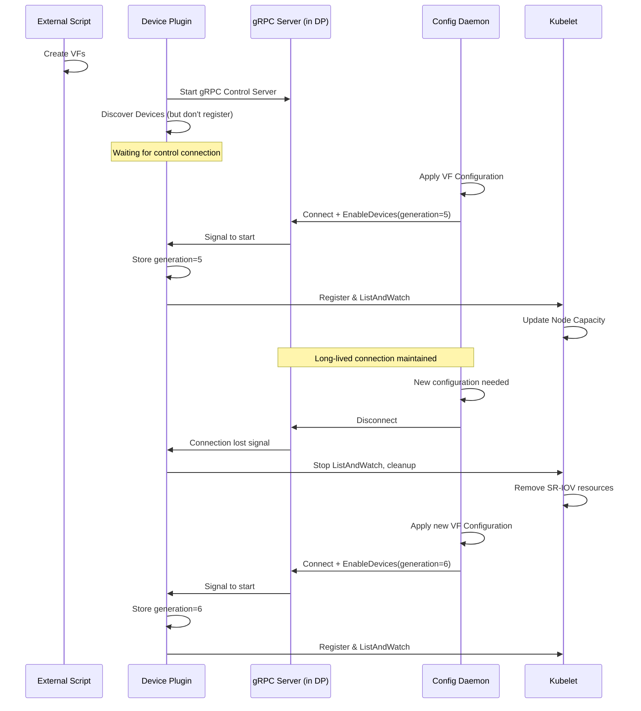

# Device Plugin gRPC Control Interface

## Summary

This design proposes implementing a gRPC server in the SR-IOV Network Device Plugin
that enables the sriov-config-daemon to establish a long-lived connection and control
when the device plugin publishes SR-IOV VF resources to kubelet. The config-daemon
passes the `SriovNetworkNodeState` generation to the device plugin, which stores it
and only starts exposing devices when connected. On disconnect, the device plugin
stops reporting devices and cleans them from kubelet.

## Motivation

### Problem Description

When using policies with `externallyManaged: true`, VFs are created by an external
script or application instead of the sriov-config-daemon. The SR-IOV Network Operator
creates the sriov-device-plugin configuration and enables its DaemonSet pod at the
same time it starts applying SR-IOV state to the node.

This creates a race condition where the sriov-device-plugin may start and announce
resources to kubelet before VFs are fully configured by the sriov-config-daemon.

#### Race Condition Sequence

After node provisioning or host reboot:

1. External script creates VFs (partially configured, e.g., no RDMA GUID assigned)
2. sriov-device-plugin pod starts, discovers VFs and announces them to kubelet
3. Kubernetes scheduler schedules pods to this node
4. Pods start with partially configured VFs
5. sriov-config-daemon applies VF configuration (unbind/bind VF driver)
6. Pods that were not evicted lose VF connectivity

#### Existing Proposal: Init Container Approach (PR #981)

PR #981 proposes adding an init container to the device plugin DaemonSet that blocks
until the config-daemon signals configuration completion via pod annotations. While
functional, this approach has several limitations:

**Complexity:**
- Requires adding an init container to the device plugin DaemonSet
- Uses Kubernetes API for coordination (pod annotation watching)
- Requires periodic polling by config-daemon to detect device plugin restarts
- Adds latency due to annotation-based signaling through the API server

**Limitations:**
- Cannot dynamically pause device reporting without pod restart
- Device plugin has no awareness of which configuration generation it should serve
- Disconnect/reconnect scenarios require pod restarts
- No direct synchronization between daemon and device plugin processes

### Use Cases

* As a user, I want pods to only receive SR-IOV VFs after they are fully configured
* As a user, I want the config-daemon to have direct control over when the device
  plugin starts and stops advertising resources
* As a user, I want the device plugin to automatically stop advertising resources
  if the config-daemon is not connected or crashes
* As a user, I want the device plugin to be aware of the configuration generation
  it is serving

### Goals

* Implement a gRPC server in the device plugin for config-daemon communication
* Enable the config-daemon to control device plugin resource announcement lifecycle
* Provide generation-based synchronization between operator and device plugin
* Automatically clean up resources when the connection is lost
* Maintain backward compatibility when the feature is not used

### Non-Goals

* Changing the drain behavior for DaemonSet pods
* Modifying how externally managed VFs are created
* Changing the VF configuration process itself
* Replacing the existing kubelet device plugin gRPC interface

## Proposal

Add a new gRPC server in the sriov-network-device-plugin that listens on a Unix
domain socket. The sriov-config-daemon establishes a long-lived streaming connection
to this server and signals when the device plugin should start exposing devices.

### Workflow Description

#### Device Plugin Startup (Controlled Mode)

When the device plugin starts with the control interface enabled:

1. Device plugin starts and initializes the gRPC control server
2. Device plugin waits for a connection from the config-daemon
3. When the config-daemon connects and sends an `EnableDevices` RPC with the
   `SriovNetworkNodeState` generation, the device plugin:
   - Stores the generation for reference
   - Starts the resource servers and registers with kubelet
   - Begins the ListAndWatch loop to expose devices
4. The connection remains open as a health check mechanism
5. If the connection is lost (daemon restart, crash, etc.), the device plugin:
   - Stops all resource servers
   - Cleans up kubelet registrations
   - Waits for a new connection

#### Config Daemon Behavior

When the config-daemon completes VF configuration:

1. After successfully applying SR-IOV configuration, connect to the device plugin
   gRPC server
2. Call `EnableDevices` RPC with the current `SriovNetworkNodeState` generation
3. Maintain the connection for the lifetime of the configuration
4. On reconfiguration that requires device plugin restart:
   - Close the existing connection (triggers device cleanup)
   - Wait for configuration to complete
   - Establish a new connection with the new generation

#### Sequence Diagram



### API Extensions

#### gRPC Service Definition

```protobuf
syntax = "proto3";

package sriovdp.control.v1;

option go_package = "github.com/k8snetworkplumbingwg/sriov-network-device-plugin/pkg/control/v1";

// ControlService provides an interface for the config-daemon to control
// the device plugin's resource announcement lifecycle.
service ControlService {
  // EnableDevices establishes a long-lived connection that signals the device
  // plugin to start exposing devices to kubelet. The connection acts as a
  // health check - when it closes, the device plugin stops advertising resources.
  // The client sends the initial request with the generation, and the server
  // streams status updates back.
  rpc EnableDevices(EnableDevicesRequest) returns (stream DevicePluginStatus);
}

// EnableDevicesRequest is sent by the config-daemon to enable device advertising.
message EnableDevicesRequest {
  // The generation of the SriovNetworkNodeState that triggered this enable.
  // This allows the device plugin to track which configuration it is serving.
  int64 node_state_generation = 1;
  
  // Optional: node name for logging/debugging purposes
  string node_name = 2;
}

// DevicePluginStatus is streamed back to the config-daemon to provide
// visibility into the device plugin state.
message DevicePluginStatus {
  // Current state of the device plugin
  State state = 1;
  
  // Number of resource pools currently being served
  int32 resource_pool_count = 2;
  
  // Total number of devices being advertised
  int32 device_count = 3;
  
  // The generation currently being served
  int64 serving_generation = 4;
  
  // Optional error message if state is ERROR
  string error_message = 5;
  
  enum State {
    UNKNOWN = 0;
    INITIALIZING = 1;
    SERVING = 2;
    ERROR = 3;
    STOPPING = 4;
  }
}
```

#### Device Plugin CLI Flags

```
--control-socket    Path to the Unix domain socket for the control interface
                    (default: /var/lib/sriov/sriovdp-control.sock)
--controlled-mode   Enable controlled mode where device plugin waits for
                    config-daemon connection before advertising devices
                    (default: false)
```

### Implementation Details/Notes/Constraints

#### Device Plugin Changes

1. **New `pkg/control` package:**
   - gRPC server implementation
   - Connection state management
   - Integration with resource manager

2. **ResourceManager modifications:**
   - Support for delayed server startup
   - Ability to start/stop all servers on demand
   - Generation tracking

3. **Main entry point changes:**
   - Parse new CLI flags
   - Conditionally start control server
   - Block on control connection in controlled mode

#### Config Daemon Changes

1. **New gRPC client:**
   - Connect to device plugin after configuration
   - Maintain long-lived connection
   - Handle reconnection on errors

2. **Integration with reconcile loop:**
   - Call `EnableDevices` after successful apply
   - Close connection when reconfiguration needed
   - Pass generation from `SriovNetworkNodeState`

#### Backward Compatibility

When `--controlled-mode=false` (default), the device plugin behaves exactly as
before - starting resource servers immediately on startup. This ensures existing
deployments continue to work without changes.

#### Error Handling

- **Connection timeout:** Config-daemon retries connection with exponential backoff
- **Unexpected disconnect:** Device plugin stops servers and waits for reconnection
- **Config-daemon crash:** Device plugin detects closed connection and cleans up
- **Device plugin restart:** Config-daemon detects disconnect and reconnects

### Comparison with Init Container Approach (PR #981)

| Aspect | Init Container (PR #981) | gRPC Control Interface |
|--------|--------------------------|------------------------|
| **Additional containers** | Yes (init container) | No |
| **Communication method** | Pod annotations via K8s API | Direct gRPC over Unix socket |
| **Latency** | Higher (API server roundtrip) | Lower (direct IPC) |
| **Generation awareness** | No | Yes |
| **Dynamic pause/resume** | Requires pod restart | Connection close/reconnect |
| **Failure detection** | Polling required | Immediate (connection closed) |
| **Resource overhead** | Additional container image | Minimal (in-process server) |
| **Kubernetes API load** | Annotation updates | None |
| **Implementation scope** | Operator only | Both operator and device plugin |
| **Complexity** | Moderate | Higher initial, simpler operation |

#### Why gRPC is Better

1. **Direct Communication:** No intermediate Kubernetes API calls reduce latency
   and eliminate potential API server bottlenecks.

2. **Generation Tracking:** The device plugin knows exactly which configuration
   generation it's serving, enabling better debugging and state verification.

3. **Immediate Failure Detection:** gRPC connection termination is detected
   immediately, unlike polling-based annotation watching.

4. **No Additional Containers:** Reduces pod startup time and resource usage.

5. **Bidirectional Status:** The device plugin can stream status updates back
   to the config-daemon, providing visibility into device advertisement state.

6. **Cleaner Lifecycle Management:** Connection-based lifecycle is more intuitive
   than annotation-based coordination.

7. **Future Extensibility:** The gRPC interface can be extended with additional
   RPCs for features like:
   - Device-level enable/disable
   - Configuration hot-reload
   - Detailed device status queries

### Upgrade & Downgrade Considerations

**Upgrade:**
- New device plugin image with control interface
- Config-daemon updated to use gRPC client
- Feature gate enables the new behavior
- Existing pods continue working; new configuration uses control interface

**Downgrade:**
- Disable feature gate
- Device plugin falls back to immediate startup
- Config-daemon stops attempting gRPC connections
- Reverts to original behavior (with potential timing issues)

**Mixed Version Scenarios:**
- Old device plugin + New config-daemon: Config-daemon connection fails, logs warning,
  device plugin works in legacy mode
- New device plugin + Old config-daemon: Device plugin waits indefinitely in
  controlled mode (should not enable controlled mode without updated daemon)

### Test Plan

#### Unit Tests

* gRPC server starts and accepts connections
* Device plugin waits for connection in controlled mode
* Device plugin starts servers after EnableDevices RPC
* Device plugin stops servers on connection close
* Generation is correctly stored and reported
* Backward compatibility when controlled mode is disabled

#### Integration Tests

* End-to-end flow with config-daemon and device plugin
* Verify devices appear in kubelet only after EnableDevices
* Verify devices are removed when connection closes
* Test reconnection scenarios
* Test config-daemon crash recovery

#### E2E Tests

* Deploy with feature gate enabled
* Verify pod scheduling waits for configuration completion
* Verify externally managed VF scenario works correctly
* Test node reboot scenarios
* Test daemon restart scenarios
