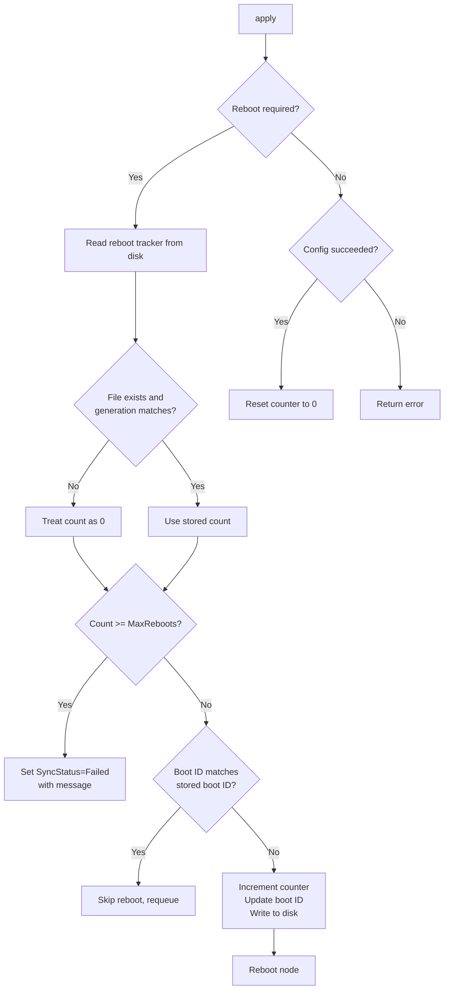

# Node Reboot Loop Limit

## Summary

Limit the number of reboots allowed for a single `SriovNetworkNodeState` generation
without manual intervention, preventing infinite reboot loops caused by
misconfigurations or bugs.

## Motivation

The SR-IOV Network Operator drains and reboots nodes for several reasons during the
operator's lifecycle, such as updating IOMMU, increasing VFs number for Mellanox or
Nvidia, switching eSwitch mode, etc.

In some cases, misconfigurations or unknown bugs can cause the applied configuration
to fail repeatedly after each reboot. Because the daemon re-enters the reconciliation
loop on startup and sees the same desired state, it triggers another reboot, creating
an infinite reboot loop. This makes the node unavailable and requires manual
intervention to recover.

### Use Cases

* As a cluster administrator, I want nodes to stop rebooting automatically after a
  limited number of failed attempts so that I can investigate and fix the issue
* As a cluster administrator, I want to see a clear failure status on the
  `SriovNetworkNodeState` when the reboot limit is reached so that I can identify
  which nodes are affected

### Goals

* Limit the number of reboots for the same configuration generation and prevent
  reboot loops
* Set the `SriovNetworkNodeState` sync status to `Failed` with a descriptive message
  when the limit is reached
* Reset the reboot counter when a new generation is applied or when configuration
  succeeds without requiring a reboot

### Non-Goals

* Exposing an API to the user to configure the maximum number of reboots
* Automatic recovery or retry after the limit is reached

## Proposal

Track the number of reboots per `SriovNetworkNodeState` generation in a YAML file on
the host filesystem. Before each reboot, increment the counter. On each reconciliation,
check if the counter has reached the maximum allowed reboots. If so, set the sync
status to `Failed` and stop reconciling.

### Workflow Description

#### Normal Operation (reboot count below limit)

1. Daemon reconciles `SriovNetworkNodeState` and determines a reboot is required
2. Daemon reads the reboot tracker file from disk
3. If the file does not exist or the stored generation differs from the current
   generation, the reboot count is treated as 0
4. Reboot count is below `MaxRebootsPerGeneration` (5), so the daemon proceeds
5. Daemon reads the current boot ID from `/proc/sys/kernel/random/boot_id` and
   compares it to the stored boot ID in the tracker file
6. If the boot ID matches (a reboot was already requested in this boot), the daemon
   skips the reboot and requeues
7. If the boot ID differs, the daemon increments the reboot counter, updates the
   boot ID and generation in the tracker file, and reboots the node

#### Reboot Limit Reached

1. Daemon reconciles `SriovNetworkNodeState` after a reboot
2. Daemon reads the reboot tracker file and finds the reboot count has reached
   `MaxRebootsPerGeneration`
3. Daemon sets `SyncStatus` to `Failed` with message:
   `"reached maximum number of allowed reboots (5) while trying to configure node"`
4. Daemon stops reconciling and returns

#### Successful Configuration

1. Daemon applies configuration successfully (no reboot needed, or configuration
   succeeds after reboot)
2. Daemon resets the reboot counter to 0 for the current generation
3. Normal operation continues

#### New Generation

1. A new `SriovNetworkNodeState` generation is created (user updates configuration)
2. Daemon reads the reboot tracker and sees the stored generation differs from the
   current generation
3. Reboot count is treated as 0, allowing fresh reboot attempts for the new
   configuration
4. On the first reboot for the new generation, `incrementRebootCounter` writes the
   new generation, count 1, and the current boot ID to the tracker file, replacing
   the old generation



### Implementation Details/Notes/Constraints

#### Reboot Tracker File

The reboot tracker is stored as a YAML file on the host at
`/var/lib/sriov/reboot-tracker.yaml` with the following structure:

```yaml
generation: 3
rebootCount: 2
bootID: "a1b2c3d4-e5f6-7890-abcd-ef1234567890"
```

The file is lazily initialized: it is created on the first write (when incrementing
or resetting the counter). Reads return a zero count when the file does not exist.

The `generation` field is updated whenever the counter is written — both
`incrementRebootCounter` and `resetRebootCounter` write the current generation. When
a new generation arrives, the first write replaces the old generation in the file.

The `bootID` field stores the value of `/proc/sys/kernel/random/boot_id` at the time
the reboot was requested. This prevents the reconciler from incrementing the counter
multiple times within the same boot — the reconciler can be triggered more than once
between when the reboot command is sent and when the node actually reboots.

#### Host Helpers Interface

A new `RebootTrackerInterface` is added to the host helpers layer with three methods:

* `ReadRebootTracker() (*RebootTrackerFile, error)` — reads and unmarshals the file,
  returns `nil, nil` if the file does not exist
* `WriteRebootTracker(tracker *RebootTrackerFile) error` — marshals and writes the
  file, creating the parent directory if needed
* `ReadBootID() (string, error)` — reads the current boot ID from
  `/proc/sys/kernel/random/boot_id`

This follows the same pattern as `ReadSriovResult`/`WriteSriovResult` on
`SystemdInterface`. The interface is separate from `SystemdInterface` because the
reboot tracker is not a systemd-specific concern.

#### Daemon Methods

Three methods are added to `NodeReconciler`:

* `readRebootCountFromDisk(generation int64) (int, error)` — reads the tracker,
  returns 0 if the file doesn't exist or the generation doesn't match
* `incrementRebootCounter(generation int64) (bool, error)` — reads the current boot
  ID from `/proc/sys/kernel/random/boot_id`. If the tracker already has the same boot
  ID (reboot already requested this boot), returns `false` without incrementing.
  Otherwise increments the counter (or creates a new tracker for a new generation),
  updates the boot ID, writes the tracker, and returns `true`. Called before
  `rebootNode()`
* `resetRebootCounter(generation int64) error` — writes the tracker with count 0 and
  the current generation. Called after successful sync

#### Call Sites in `apply()`

1. **When `reqReboot` is true, before rebooting** — read the counter and bail with
   `SyncStatusFailed` if the limit is reached
2. **When `reqReboot` is true, after the limit check** — increment the counter. If
   `incrementRebootCounter` returns `false` (boot ID matches, reboot already requested
   this boot), requeue instead of rebooting again
3. **After successful sync** — reset the counter

#### Atomicity

The write-then-reboot sequence is not atomic. If the process crashes after
incrementing but before rebooting, the counter is incremented without a reboot. This
is the conservative direction: reaching the limit sooner is safer than looping forever.
The boot ID check mitigates the more common case where the reconciler is triggered
multiple times before the reboot actually happens — the counter is only incremented
once per boot.

### Upgrade & Downgrade considerations

**Upgrade**: When upgrading to a version with this feature:
- No reboot tracker file exists on disk, so all nodes start with a reboot count of 0
- No impact on currently running configurations
- The feature is always active (no feature gate)

**Downgrade**: When downgrading to a version without this feature:
- The reboot tracker file remains on disk but is ignored
- No impact on operation

### Test Plan

* Should proceed to reboot when count is below the limit
* Should set sync status to failed when count reaches the limit
* Should requeue when reboot was already counted this boot
* Should start fresh counter when generation changes even with same boot ID
* Should create new tracker when no tracker file exists
* Should reset reboot counter on success
