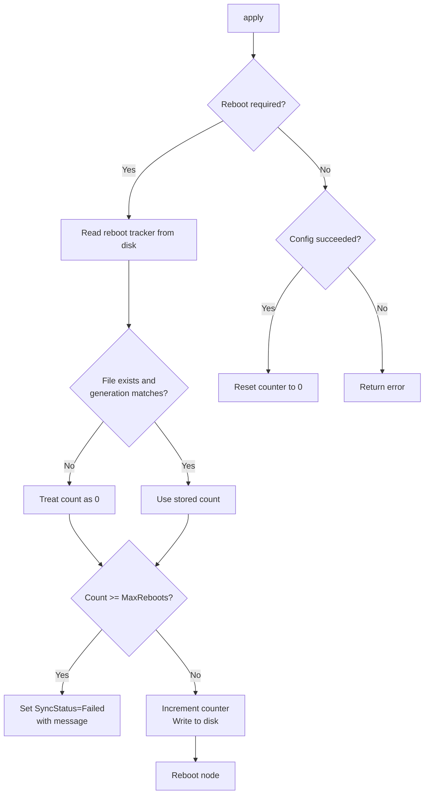

# Node Reboot Loop Limit

## Summary

Limit the number of reboots allowed for a single `SriovNetworkNodeState` generation
without manual intervention, preventing infinite reboot loops caused by
misconfigurations or bugs.

## Motivation

The SR-IOV Network Operator drains and reboots nodes for several reasons during the
operator's lifecycle, such as updating IOMMU, increasing VFs number for NVIDIA
Mellanox cards firmware, switching eSwitch mode, etc.

In some cases, misconfigurations or unknown bugs can cause the applied configuration
to fail repeatedly after each reboot. Because the daemon re-enters the reconciliation
loop on startup and sees the same current state != desired state, it triggers another
reboot, creating an infinite reboot loop. This makes the node unavailable and requires
manual intervention to recover. This is even more critical for single-node clusters,
where removing the policy is more challenging as the API server is down while the node
is rebooting.

### Use Cases

* As a cluster administrator, I want nodes to stop rebooting automatically after a
  limited number of failed attempts so that I can investigate and fix the issue
* As a cluster administrator, I want to see a clear failure status on the
  `SriovNetworkNodeState` when the reboot limit is reached so that I can identify
  which nodes are affected

### Goals

* Limit the number of reboots for the same configuration generation and prevent
  reboot loops
* Set the `SriovNetworkNodeState` sync status to `Failed` with a descriptive message
  when the limit is reached
* Reset the reboot counter when a new generation is applied or when configuration
  succeeds without requiring a reboot

### Non-Goals

* Exposing an API to the user to configure the maximum number of reboots
* Automatic recovery or retry after the limit is reached

## Proposal

Track the number of reboots per `SriovNetworkNodeState` generation in a YAML file on
the host filesystem. Before each reboot, increment the counter. On each reconciliation,
check if the counter has reached the maximum allowed reboots. If so, set the sync
status to `Failed` and stop reconciling.

### Workflow Description

#### Normal Operation (reboot count below limit)

1. Daemon reconciles `SriovNetworkNodeState` and determines a reboot is required
2. Daemon reads the reboot tracker file from disk
3. If the file does not exist or the stored generation differs from the current
   generation, the reboot count is treated as 0
4. Reboot count is below `MaxRebootsPerGeneration` (5), so the daemon proceeds
5. Daemon increments the reboot counter and writes the updated tracker file
6. Daemon reboots the node

#### Reboot Limit Reached

1. Daemon reconciles `SriovNetworkNodeState` after a reboot
2. Daemon reads the reboot tracker file and finds the reboot count has reached
   `MaxRebootsPerGeneration`
3. Daemon sets `SyncStatus` to `Failed` with message:
   `"reached maximum number of allowed reboots (5) while trying to configure node"`
4. Daemon stops reconciling and returns

#### Successful Configuration

1. Daemon applies configuration successfully (no reboot needed, or configuration
   succeeds after reboot)
2. Daemon resets the reboot counter to 0 for the current generation
3. Normal operation continues

#### New Generation

1. A new `SriovNetworkNodeState` generation is created (user updates configuration)
2. Daemon reads the reboot tracker and sees the stored generation differs from the
   current generation
3. Reboot count is treated as 0, allowing fresh reboot attempts for the new
   configuration
4. On the first reboot for the new generation, `IncrementRebootCounter` writes the
   new generation with count 1 to the tracker file, replacing the old generation


```mermaid
flowchart TD
    A[apply] --> B{Reboot required?}
    B -->|Yes| C[Read reboot tracker from disk]
    C --> D{File exists and\ngeneration matches?}
    D -->|No| E[Treat count as 0]
    D -->|Yes| F[Use stored count]
    E --> G{Count >= MaxReboots?}
    F --> G
    G -->|Yes| H[Set SyncStatus=Failed\nwith message]
    G -->|No| K[Increment counter\nWrite to disk]
    K --> L[Reboot node]
    B -->|No| M{Config succeeded?}
    M -->|Yes| N[Reset counter to 0]
    M -->|No| O[Return error]
```

### Implementation Details/Notes/Constraints

#### Reboot Tracker File

The reboot tracker is stored as a YAML file on the host at
`/var/lib/sriov/reboot-tracker.yaml` with the following structure:

```yaml
generation: 3
rebootCount: 2
```

The file is lazily initialized: it is created on the first write (when incrementing
or resetting the counter). Reads return a zero count when the file does not exist.

The `generation` field is updated whenever the counter is written — both
`IncrementRebootCounter` and `ResetRebootCounter` write the current generation. When
a new generation arrives, the first write replaces the old generation in the file.

#### Host Helpers Interface

A new `RebootTrackerInterface` is added to the host helpers layer with three
high-level methods:

* `GetRebootCount(generation int64) (int, error)` — reads the tracker file and
  returns the reboot count. Returns 0 if the file does not exist or the stored
  generation differs from the given generation
* `IncrementRebootCounter(generation int64) error` — reads the tracker, increments
  the count (or creates a new tracker for a new generation), and writes atomically
* `ResetRebootCounter(generation int64) error` — writes the tracker with count 0 and
  the given generation

File I/O (read, write, atomic rename) is encapsulated as private methods in the
`reboottracker` package. The interface is separate from `SystemdInterface` because
the reboot tracker is not a systemd-specific concern.

#### Call Sites in `apply()`

1. **When `reqReboot` is true, before rebooting** — read the counter and bail with
   `SyncStatusFailed` if the limit is reached
2. **When `reqReboot` is true, after the limit check** — increment the counter and
   reboot
3. **After successful sync** — reset the counter

#### Atomicity

The write-then-reboot sequence is not atomic. If the process crashes after
incrementing but before rebooting, the counter is incremented without a reboot. This
is the conservative direction: reaching the limit sooner is safer than looping
forever.

### Upgrade & Downgrade considerations

**Upgrade**: When upgrading to a version with this feature:
- No reboot tracker file exists on disk, so all nodes start with a reboot count of 0
- No impact on currently running configurations
- The feature is always active (no feature gate)

**Downgrade**: When downgrading to a version without this feature:
- The reboot tracker file remains on disk but is ignored
- No impact on operation

### Test Plan

* Should proceed to reboot when count is below the limit
* Should set sync status to failed when count reaches the limit
* Should start fresh counter when generation changes
* Should propagate error from GetRebootCount
* Should propagate error from IncrementRebootCounter
* Should reset reboot counter on success
* Should propagate error from ResetRebootCounter
