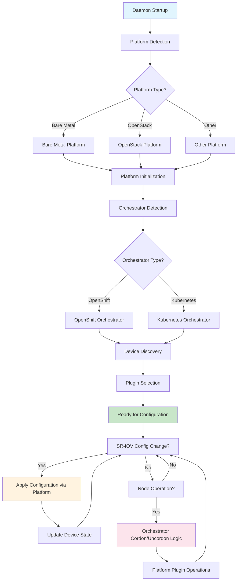

# Platform and Orchestrator Abstraction

## Summary

This design document describes the introduction of platform and orchestrator abstraction layers in the SR-IOV Network Operator. These abstractions separate platform-specific (infrastructure provider) logic from orchestrator-specific (Kubernetes distribution) logic, making it easier to add support for new infrastructure platforms and Kubernetes distributions.

## Motivation

The SR-IOV Network Operator has historically been tightly coupled to specific infrastructure platforms and Kubernetes distributions, particularly OpenShift. As the operator expanded to support different virtualization platforms like OpenStack, AWS, Oracle and various Kubernetes distributions, the need for a clean abstraction layer became apparent.

### Use Cases

1. **Multi-Platform Support**: Enable the operator to run efficiently on different infrastructure platforms (bare metal, OpenStack, AWS, Oracle, etc.) with platform-specific optimizations
2. **Multi-Orchestrator Support**: Support different Kubernetes distributions (vanilla Kubernetes, OpenShift, etc.) with orchestrator-specific behaviors

### Goals

* Create a clean abstraction layer that separates platform-specific logic from orchestrator-specific logic
* Re-implement existing support for bare metal and OpenStack platforms using the new abstraction layer
* Re-implement existing support for Kubernetes and OpenShift orchestrators using the new abstraction layer
* Provide a plugin architecture that makes it easy to add new platforms and orchestrators
* Maintain backward compatibility with existing functionality
* Enable better testability through interface-based design

### Non-Goals

* Support all possible infrastructure platforms in the initial implementation
* Change existing SR-IOV CRD API structures or user-facing configuration interfaces

## Proposal

### Workflow Description

1. **Daemon Startup**: The SR-IOV daemon detects the platform type by examining the node's provider ID and environment variables
2. **Platform Initialization**: The appropriate platform implementation is instantiated using the factory pattern and initialized
3. **Orchestrator Detection**: The orchestrator type is detected based on cluster APIs and characteristics
4. **Device Discovery**: The platform interface discovers available SR-IOV devices using platform-specific methods
5. **Plugin Selection**: The platform selects appropriate vendor plugins based on discovered devices and platform constraints
6. **Configuration Application**: When SR-IOV configurations change, the daemon uses the platform interface to apply changes through the selected plugins
7. **Node Management**: During node operations, the orchestrator interface handles any distribution-specific logic like cordon/uncordon coordination

*NOTE:* The platform is detected at startup based on node metadata and environment variables, while the orchestrator is detected based on cluster characteristics and available APIs.



### API Extensions

#### Platform Interface

```golang
type Interface interface {
    // Init initializes the platform-specific components and validates the platform environment
    Init() error

    // GetHostHelpers returns the platform-specific host helpers interface for system operations
    // This allows platforms to provide platform-specific implementations for file operations,
    // command execution, and system interactions while maintaining testability through mocking
    GetHostHelpers() helper.HostHelpersInterface

    // DiscoverSriovDevices discovers and returns all available SR-IOV capable devices on the platform
    // The discovery method varies by platform (PCI scanning for bare metal, metadata service for cloud)
    DiscoverSriovDevices() ([]sriovnetworkv1.InterfaceExt, error)

    // DiscoverBridges discovers and returns bridge configuration information
    // Not supported on all platforms (e.g., not available in some virtualized environments)
    DiscoverBridges() (sriovnetworkv1.Bridges, error)

    // GetPlugins returns the appropriate vendor plugins for the platform based on the node state
    // Returns the selected plugin and a list of all available plugins for the platform
    GetPlugins(ns *sriovnetworkv1.SriovNetworkNodeState) (plugin.VendorPlugin, []plugin.VendorPlugin, error)

    // SystemdGetPlugin returns the appropriate plugin for systemd-based configuration phases
    // Not supported on all platforms (returns error for platforms that don't support systemd mode)
    SystemdGetPlugin(phase string) (plugin.VendorPlugin, error)
}
```

#### Orchestrator Interface

```golang
type Interface interface {
    // ClusterType returns the detected Kubernetes distribution type (e.g., OpenShift, Kubernetes)
    ClusterType() consts.ClusterType

    // Flavor returns the specific flavor/variant of the orchestrator (e.g., Vanilla, Hypershift for OpenShift)
    Flavor() consts.ClusterFlavor

    // BeforeNodeCordonProcess performs orchestrator-specific actions before cordoning a node
    // Returns true if the cordon operation should proceed, false to skip cordoning
    BeforeNodeCordonProcess(context.Context, *corev1.Node) (bool, error)

    // AfterNodeUncordonProcess performs orchestrator-specific cleanup actions after uncordoning completes
    // Returns true if post-uncordon operations completed successfully
    AfterNodeUncordonProcess(context.Context, *corev1.Node) (bool, error)
}
```

### Implementation Details/Notes/Constraints

#### Platform Implementations

1. **Bare Metal Platform (`pkg/platform/baremetal/`)**:
   - Uses standard SR-IOV device discovery
   - Supports vendor-specific plugins (Intel, Mellanox)
   - Handles bridge discovery and management
   - Supports both daemon and systemd configuration modes

2. **OpenStack Platform (`pkg/platform/openstack/`)**:
   - Uses virtual device discovery based on OpenStack metadata
   - Reads device information from config-drive or metadata service
   - Uses virtual plugin for VF configuration
   - Does not support systemd mode or bridge management

#### Orchestrator Implementations

1. **Kubernetes Orchestrator (`pkg/orchestrator/kubernetes/`)**:
   - Simple implementation with minimal cluster-specific logic
   - No special cordon/uncordon handling (returns true for all cordon/uncordon operations)
   - Vanilla Kubernetes flavor

2. **OpenShift Orchestrator (`pkg/orchestrator/openshift/`)**:
   - Complex cordon/uncordon handling with Machine Config Pool management
   - Supports both regular OpenShift and Hypershift flavors
   - Manages MCP pausing during node operations

#### Platform Detection

Platform detection occurs in the daemon startup code based on:
- Node provider ID examination
- Environment variables
- Available metadata services

```golang
// Platform detection logic
for key, pType := range vars.PlatformsMap {
    if strings.Contains(strings.ToLower(nodeInfo.Spec.ProviderID), strings.ToLower(key)) {
        vars.PlatformType = pType
    }
}
```

#### Factory Pattern

Both platform and orchestrator use factory patterns for instantiation, facilitating easy extensions for new implementations:

```golang
// Platform factory
func New(hostHelpers helper.HostHelpersInterface) (Interface, error) {
    switch vars.PlatformType {
    case consts.Baremetal:
        return baremetal.New(hostHelpers)
    case consts.VirtualOpenStack:
        return openstack.New(hostHelpers)
    default:
        return nil, fmt.Errorf("unknown platform type %s", vars.PlatformType)
    }
}

// Orchestrator factory
func New() (Interface, error) {
    switch vars.ClusterType {
    case consts.ClusterTypeOpenshift:
        return openshift.New()
    case consts.ClusterTypeKubernetes:
        return kubernetes.New()
    default:
        return nil, fmt.Errorf("unknown orchestration type: %s", vars.ClusterType)
    }
}
```

### Upgrade & Downgrade considerations

Existing configurations and behaviors are preserved, with the abstraction layer providing the same functionality through the new interface structure.

No user-facing API changes are required, and existing SR-IOV configurations will continue to work without modification.

### Test Plan

The implementation includes comprehensive unit tests for both platform and orchestrator abstractions:

1. **Platform Tests**: Test device discovery, plugin loading, and platform-specific behaviors for both bare metal and OpenStack platforms
2. **Orchestrator Tests**: Test cluster type detection, cordon/uncordon handling, and orchestrator-specific behaviors for both Kubernetes and OpenShift
3. **Integration Tests**: Ensure the abstractions work correctly with the existing daemon and operator logic
4. **Mock Interfaces**: Generated mock interfaces enable comprehensive unit testing of components that depend on platform and orchestrator abstractions

## Benefits for Adding New Platforms

### 1. Clear Separation of Concerns

The abstraction separates infrastructure-specific logic (platform) from Kubernetes distribution-specific logic (orchestrator), making it easier to reason about and implement support for new platforms.

### 2. Standardized Interface

New platforms only need to implement the well-defined `Platform Interface`, which includes:
- Device discovery methods
- Plugin selection logic
- Platform-specific initialization

### 3. Minimal Core Changes

Adding a new platform requires:
1. Creating a new package under `pkg/platform/<platform-name>/`
2. Implementing the `Platform Interface`
3. Adding the platform to the factory function
4. Adding platform detection logic

No changes to core operator logic, existing platforms, or user-facing APIs are required.

### 4. Plugin Architecture

The platform interface includes plugin selection methods, allowing each platform to:
- Choose appropriate vendor plugins
- Use platform-specific plugins (like the virtual plugin for OpenStack)
- Support different configuration modes (daemon vs systemd)

### 5. Independent Development and Testing

Each platform implementation is self-contained, enabling:
- Independent development of platform support
- Platform-specific unit tests
- Mock-based testing of platform interactions
- Easier debugging and maintenance

### Example: Adding a New Platform

Adding support for a new platform follows a standardized process:

1. **Create Platform Package**: Create a new package under `pkg/platform/<platform-name>/` that implements the Platform Interface
2. **Platform Detection**: Add platform detection logic to identify the new platform based on node metadata or environment variables
3. **Factory Registration**: Register the new platform in the factory function to enable instantiation
4. **Plugin Integration**: Implement platform-specific plugin selection and device discovery logic
5. **Testing**: Add comprehensive unit tests for the new platform implementation

This standardized approach ensures that new platforms integrate seamlessly with the existing operator architecture without requiring changes to core logic or other platform implementations. 